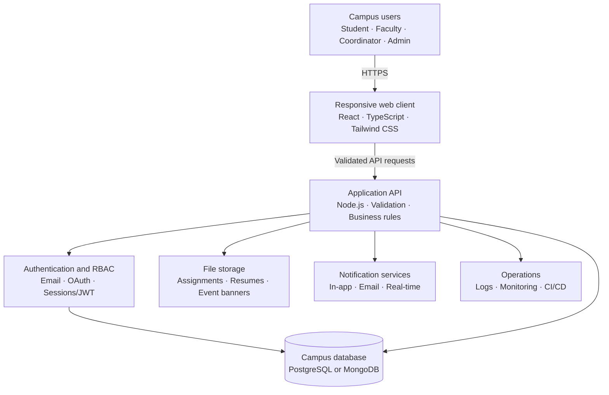
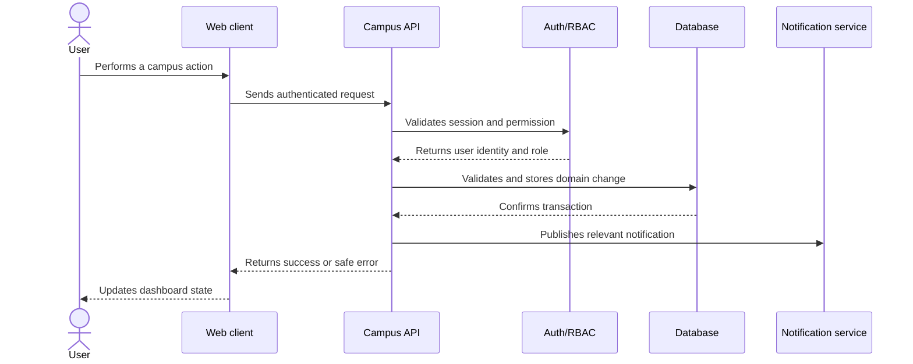

# Northstar EdTech - Architecture Diagram

This deployment-neutral architecture matches the Smart Campus Management Platform requirements. Replace provider names with the services used in the actual repository.

## Request flow

## Main application modules

| Module | Primary responsibility |
|---|---|
| Authentication | Registration, login, verification, recovery and logout |
| Authorization | Server-side role and permission enforcement |
| Users | Profiles, departments, roles and account status |
| Attendance | Sessions, records, summaries and reports |
| Assignments | Creation, submission, grading and feedback |
| Events | Creation, capacity, registration and QR passes |
| Placements | Opportunities, eligibility, applications and status |
| Notifications | In-app, email and real-time delivery |
| Analytics | Attendance, assignment, event and placement summaries |
| Audit | Sensitive administrative and academic changes |

## Deployment notes

- Serve every public and authenticated route through HTTPS.
- Keep database, session, OAuth and storage secrets in environment variables.
- Store uploaded files in object storage rather than directly in the application container.
- Apply authorization inside API handlers; hiding a menu item is not a security control.
- Add indexes for email, course, student, session, assignment, event and notification queries.
- Use structured logs and health checks to diagnose deployment failures.
- Back up the database and restrict administrative access.

