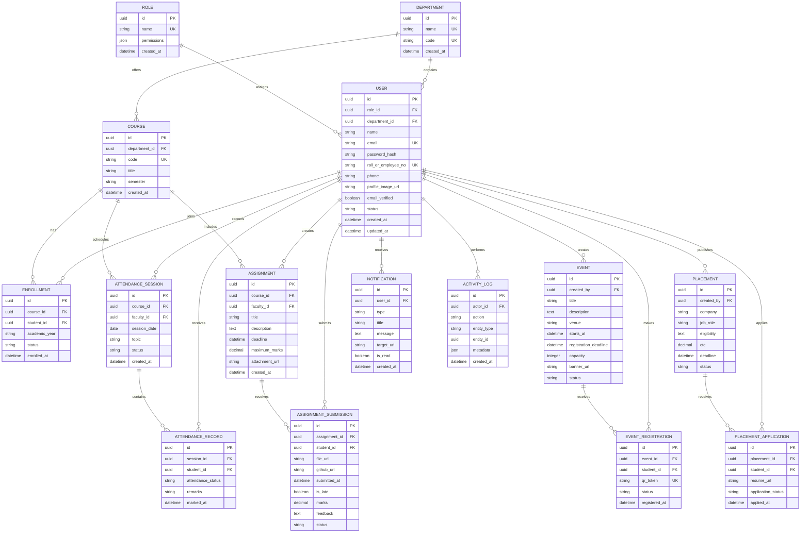

# Northstar EdTech - ER Diagram

This logical model covers the minimum data required for users, attendance, assignments, events, placements and notifications. Rename fields to match the actual database before submission.

## Recommended constraints

- One role name and one user email must be unique.
- One student may have only one enrollment per course and academic year.
- One attendance record may exist per student and attendance session.
- One submission may exist per student and assignment unless resubmission is explicitly supported.
- One active event registration may exist per student and event.
- One placement application may exist per student and opportunity.
- Deleting academic records should normally be restricted; use status fields and audit logs instead.

